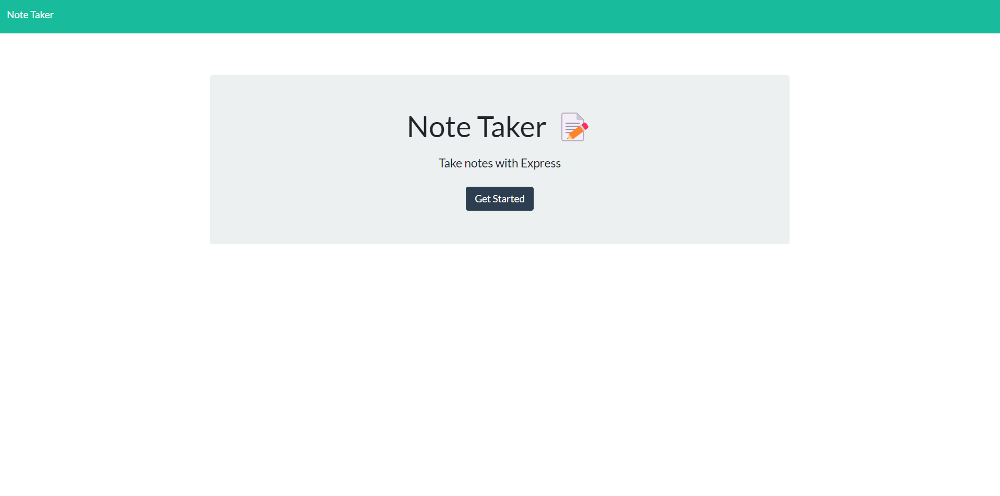
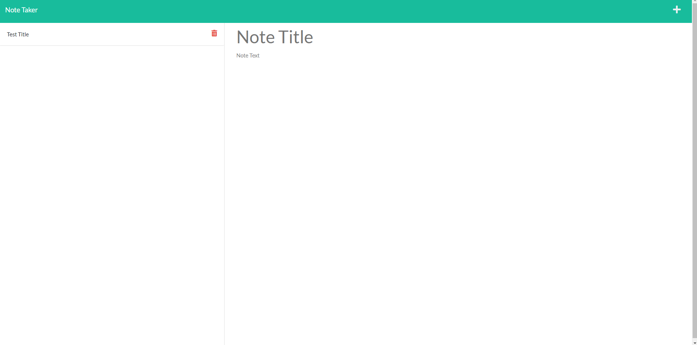
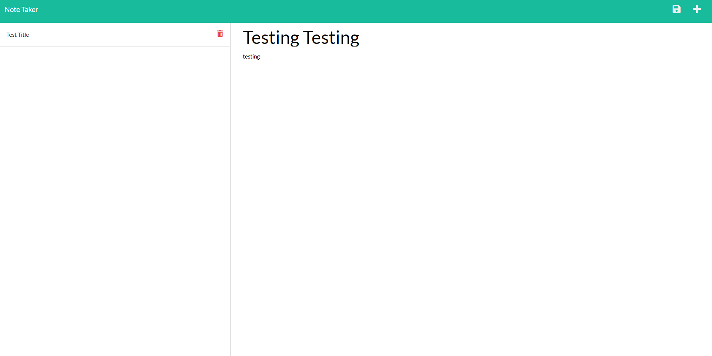
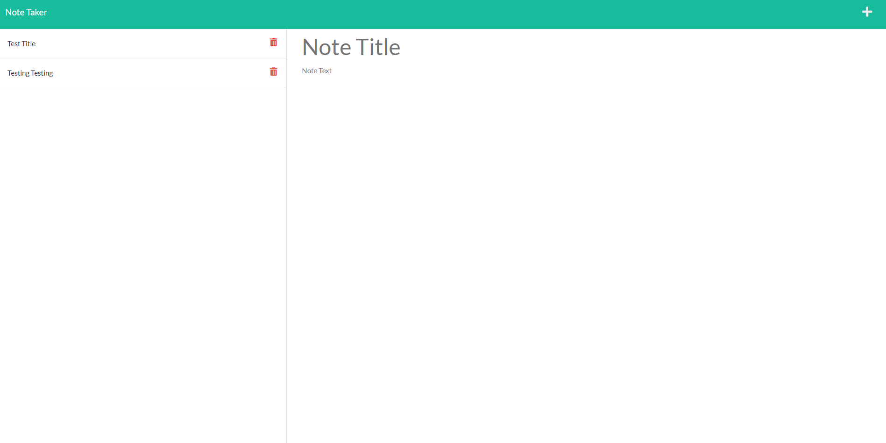

## The-Note-Taker-5000

## Table of Contents

1.  [Documentation](#documentation)
1.  [Description](#description)
2.  [Installation](#installation)
2.  [Usage](#usage)
3.  [Contributing](#contributing)
2.  [Test](#test)
4.  [License](#license)
4.  [Contact](#contact)
    1. [GitHub](#gitHub)
    2. [Email](#email)
    

### Description

The-Note-Taker-5000 is a small web application dedicated to allowing the user to quickly take notes and save them for later.

### Installation

npm i before running

### Usage

On start up the application will present you with the landing page. Clicking the get started button will take you to your notes page and allow you to begin taking notes in the right hand column. The left hand column should display your previous notes, and once your are ready to save your current note you can select the save icon in the top right.

## Contributing

submit a pull request

## License

GNU General Public License v3.0

## Test

none

## Contact

https://github.com/Droessling94

droessling94@gmail.com

## Screen Shots - HomePage

## Screen Shots - Notes Landing Page

## Screen Shots - Typed Noted Before Save

## Screen Shots - Typed Noted After Save

